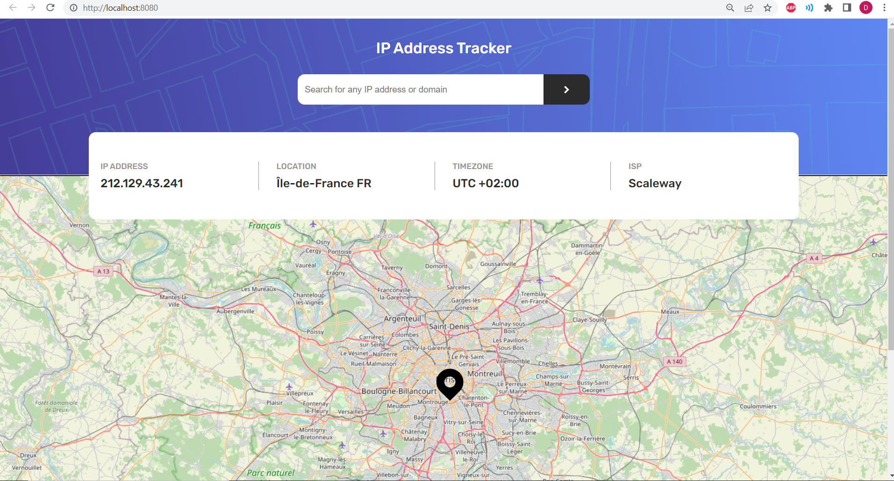

# Frontend Mentor - IP address tracker solution

This is a solution to the [IP address tracker challenge on Frontend Mentor](https://www.frontendmentor.io/challenges/ip-address-tracker-I8-0yYAH0). Frontend Mentor challenges help you improve your coding skills by building realistic projects. 

## Table of contents

- [Overview](#overview)
  - [The challenge](#the-challenge)
  - [Screenshot](#screenshot)
  - [Links](#links)
- [My process](#my-process)
  - [Built with](#built-with)
- [Author](#author)

## Overview

### The challenge

Users should be able to:

- View the optimal layout for each page depending on their device's screen size
- See hover states for all interactive elements on the page
- See their own IP address on the map on the initial page load
- Search for any IP addresses or domains and see the key information and location

### Screenshot

### Links

- Solution URL: [link](https://github.com/dodoburner/IP-Adress-Tracker)
- Live Site URL: [link](https://dodoburner.github.io/IP-Adress-Tracker/)

## My process

### Built with

- Semantic HTML5 markup
- CSS
- Flexbox
- CSS Grid
- Mobile-first workflow
- Github Flow
- JavaScript, using ES6 and modules
- Webpack
- IP Geolocation API
- Leaflet

## Author

- GitHub: [@dodoburner](https://github.com/dodoburner)
- Twitter: [@DorianUrem](https://twitter.com/DorianUrem)
- LinkedIn: [Dorian Urem](https://www.linkedin.com/in/dorian-urem-252baa237/)